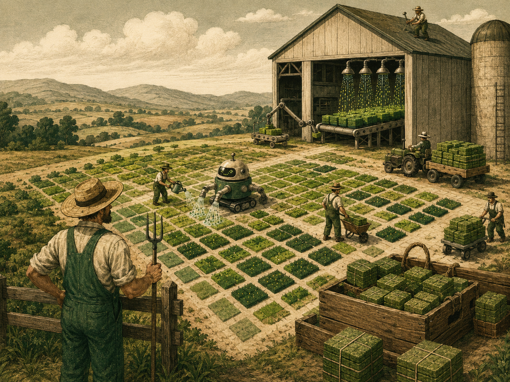

# Fake Grass Farmer



## これは何

GitHubの草を、労働ではなく農業で育てるための、たいへん真面目なふざけたシステムです。

人間は寝ます。

Actionsは起きます。

草は、まあ、なんか生えます。

このリポジトリでは毎日1回、GitHub Actionsが自動で起動し、`0` から `6` 回のランダムな回数だけ `data/fake_grass.log` に記録を追加して commit します。

つまりこれは、GitHubのContribution Graphに向けた全自動温室です。

## 仕組み

毎日、日本時間 `00:15` になると農場が開きます。

```text
00:15 JST
15:15 UTC
```

その日の農作業量はランダムです。

```text
0回: 休耕日。農家は寝ている。
1回: ちょっと水をやった。
2〜3回: それなりに畑っぽい。
4〜6回: 今日は豊作。草、繁茂。
```

実際にはこのへんが動いています。

```bash
python farmer.py --count
python farmer.py --entry-index 1 --entry-total 6
```

`farmer.py --count` が今日のcommit回数を `0〜6` で決めます。

その回数ぶん `fake_grass.log` に1行ずつ追記して、1行ごとに1commitします。

## ファイル構成

```text
fake-grass-farmer/
├── README.md
├── farmer.py
├── assets/
│   └── fake-grass-farmer.png
├── data/
│   └── .gitkeep
└── .github/
    └── workflows/
        └── fake-grass-farmer.yml
```

## 生成されるもの

初回実行後、ここに農作業日誌ができます。

```text
data/fake_grass.log
```

中身はだいたいこんな感じです。

```text
run_date=2026-05-18 entry=1/4 jst=2026-05-18T00:15:02+09:00 utc=2026-05-17T15:15:02+00:00 Green pixels were cultivated successfully.
```

これは日誌です。

成果物です。

言い張れば農業です。

## 手動で農作業する

GitHubのActionsタブから実行できます。

```text
Actions
→ Fake Grass Farmer
→ Run workflow
```

運がよければ草が生えます。

運が悪ければ `0` が出て休耕日です。

それもまた自然。

## 注意

このプロジェクトはジョークです。

生産性の証明には使えません。

努力の証明にも使えません。

ただし、農業をしているという気持ちにはなれます。

草は偽物です。

農家は正直です。
